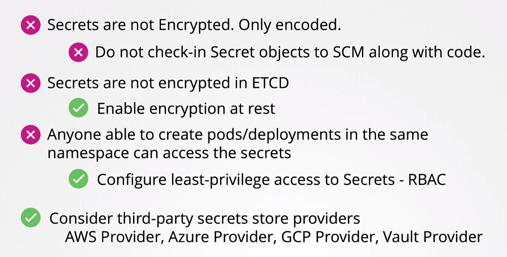

```shell
echo -n 'password' | base64 
# ouputs cGFzc3dvcmQ=
# base64 --decode can be used to decode
k apply -f .
```
Secret by default are not encrypted at rest
For encryption configuration https://kubernetes.io/docs/tasks/administer-cluster/encrypt-data/  or external cloud secret provider
